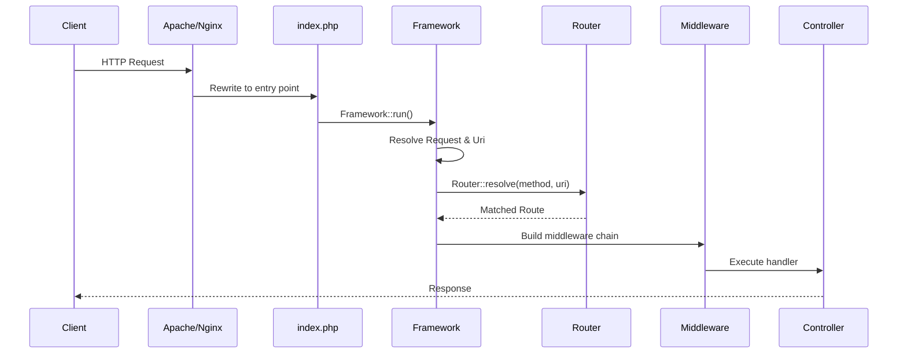

# Request Handling

The `Selvi\Input\Request` class provides a clean interface to access incoming HTTP request data.

## Accessing Request Data

Inject `Request` via type-hint in any controller method:

```php
use Selvi\Input\Request;

class ProdukController {
    function insert(Request $request) {
        $data = json_decode($request->raw(), true);
        // ...
    }
}
```

## Available Methods

### HTTP Method

```php
$method = $request->method();  // 'GET', 'POST', 'PATCH', 'DELETE', etc.
```

### Headers

```php
// Get a specific header
$auth = $request->header('Authorization');

// Get all headers
$allHeaders = $request->header();
```

### POST Data

```php
$name = $request->post('nmProduk');
```

### Query String (GET) Parameters

```php
$page = $request->get('page');
$search = $request->get('q');
```

### Raw Request Body (JSON)

```php
$raw = $request->raw();
$data = json_decode($raw, true);
```

For JSON APIs, always use `raw()` to get the request body, then decode it.

### File Uploads

```php
$file = $request->file('attachment');
// Returns: ['name', 'type', 'tmp_name', 'error', 'size']
```

### Cookies

```php
$refreshToken = $request->cookie('refresh');
```

## The Route Object

Access the matched route for parameters and metadata:

```php
$route = $request->route();
$params = $route->params();
$uriParams = $route->getParam('id');
```

## URI Information

The `Selvi\Input\Uri` class provides URL utilities:

### Via Helper Functions

```php
// Current full URL
$url = currentUrl();

// Base URL (scheme + host + subdirectory)
$base = baseUrl();

// Site URL (base + path)
$fullUrl = siteUrl('/produk');
```

### Via Uri Instance

```php
use Selvi\Input\Uri;
use Selvi\Factory;

$uri = Factory::resolve(Uri::class);

// URI string: '/produk/42'
$string = $uri->string();

// URI segments: ['produk', '42']
$segments = $uri->segments();

// Specific segment (1-indexed): 'produk'
$first = $uri->segment(1);
```

## Complete Request Flow



## Best Practices

1. **Always inject `Request`** — don't use `$_POST`, `$_GET`, or `$_SERVER` directly
2. **Validate input** — check for required fields before processing
3. **Use `raw()` for JSON APIs** — `$_POST` only works for form-encoded data
4. **Return appropriate status codes** — `400` for bad input, `415` for wrong Content-Type
5. **Sanitize file uploads** — validate type, size, and extension
